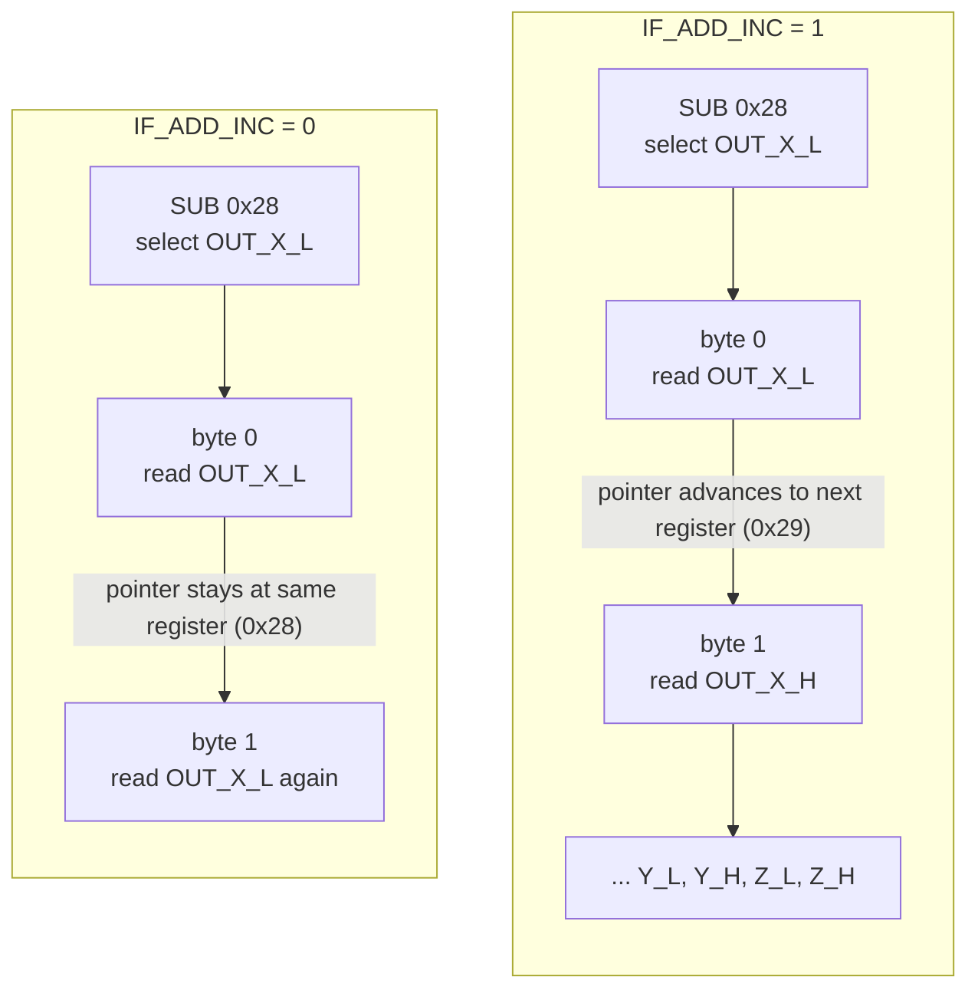
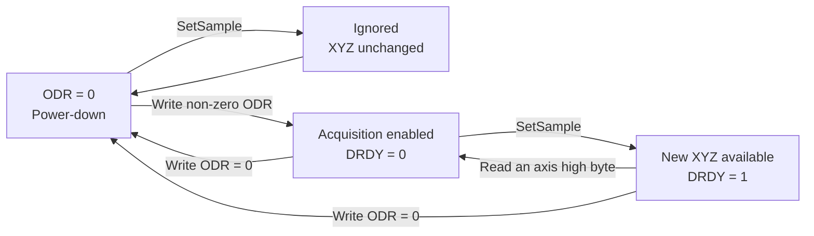

# Modeling an I2C Accelerometer in Renode: LIS2DW12

The LIS2DW12 is a three-axis accelerometer with a register-based interface.
Renode already provides a model of this device. In this tutorial, we build a
smaller version from the datasheet and connect it to STM32 firmware.

We use the [official model](https://github.com/renode/renode-infrastructure/blob/master/src/Emulator/Peripherals/Peripherals/Sensors/LIS2DW12.cs)
as an architectural reference and for comparison. The tutorial reconstructs a
possible development process; it does not describe the original authors' thoughts.
Hardware behavior comes from the [ST DS11811 Rev. 9 datasheet](https://www.st.com/resource/en/datasheet/lis2dw12.pdf).

The scope is a reduced but practical flow: identify the device, apply basic
initialization, read XYZ samples, and observe data-ready by polling or interrupt.
The same firmware is run against our model and Renode's official model for comparison.
The [optional GUI](#7-optional-interactive-web-view-vibe-coded) and utility
scripts are 100% *vibe coded* support assets and are not
part of the modeling lesson. See [Limits and References](#8-limits-and-references)
for the detailed boundaries.

Recommended preparation: the [PCF8574 tutorial](https://github.com/moschiel/renode-pcf8574-tutorial).
It introduces C# models, REPL platforms, and the Monitor. Here we move on to
register maps and transaction state.

## Contents

- [1. Set up the project and I2C skeleton](#1-set-up-the-project-and-i2c-skeleton)
  - [1.1 Separate I2C transport from register storage](#11-separate-i2c-transport-from-register-storage)
  - [1.2 Create the model](#12-create-the-model)
  - [1.3 Check the transport with temporary storage](#13-check-the-transport-with-temporary-storage)
  - [1.4 Run the stage 1 validation](#14-run-the-stage-1-validation)
- [2. WHO_AM_I and STM32 firmware](#2-who_am_i-and-stm32-firmware)
  - [2.1 Register behavior](#21-register-behavior)
  - [2.2 Implement the register](#22-implement-the-register)
  - [2.3 Validate the model](#23-validate-the-model)
  - [2.4 Prepare the STM32 firmware](#24-prepare-the-stm32-firmware)
  - [2.5 Connect the STM32](#25-connect-the-stm32)
- [3. Read XYZ output data](#3-read-xyz-output-data)
  - [3.1 Output register behavior](#31-output-register-behavior)
  - [3.2 Define the XYZ registers](#32-define-the-xyz-registers)
  - [3.3 Validate the model](#33-validate-the-model)
  - [3.4 Read XYZ from the STM32](#34-read-xyz-from-the-stm32)
- [4. Configure multi-byte register access](#4-configure-multi-byte-register-access)
  - [4.1 IF_ADD_INC behavior](#41-if_add_inc-behavior)
  - [4.2 Define CTRL2](#42-define-ctrl2)
  - [4.3 Validate both reading styles](#43-validate-both-reading-styles)
- [5. Configure acquisition and poll data-ready](#5-configure-acquisition-and-poll-data-ready)
  - [5.1 ODR and DRDY behavior](#51-odr-and-drdy-behavior)
  - [5.2 Define CTRL1 and STATUS](#52-define-ctrl1-and-status)
  - [5.3 Validate polling](#53-validate-polling)
  - [5.4 Check the STM32 firmware](#54-check-the-stm32-firmware)
- [6. Route data-ready to INT1](#6-route-data-ready-to-int1)
  - [6.1 Interrupt behavior](#61-interrupt-behavior)
  - [6.2 Define CTRL4 and Interrupt1](#62-define-ctrl4-and-interrupt1)
  - [6.3 Connect INT1 to the STM32](#63-connect-int1-to-the-stm32)
  - [6.4 Validate the interrupt path](#64-validate-the-interrupt-path)
- [7. Optional interactive web view](#7-optional-interactive-web-view-vibe-coded)
- [8. Limits and References](#8-limits-and-references)
  - [8.1 Optional model comparison](#81-optional-model-comparison)

## 1. Set up the project and I2C skeleton


You need **Renode 1.16.1** on your PATH.
See the [installation guide](https://renode.readthedocs.io/en/latest/introduction/installing.html).
The Python interpreter used by the `python` command inside the Monitor is
included with Renode.

In the **Terminal**, check:

```sh
renode --version
```

**Expected:** Renode prints its version without a command-not-found error.

From this tutorial repository's root, create a separate sibling working
directory. It receives the supplied validation scripts; you will create the
model, platform, and script files from the blocks below.

**Windows / PowerShell:**

```powershell
New-Item -ItemType Directory ..\my-lis2dw12 -ErrorAction Stop
New-Item -ItemType Directory ..\my-lis2dw12\models, ..\my-lis2dw12\platforms, ..\my-lis2dw12\scripts, ..\my-lis2dw12\tools
Copy-Item -Recurse tests ..\my-lis2dw12\tests
Copy-Item -Recurse firmware ..\my-lis2dw12\firmware
Copy-Item tools\build_firmware.py ..\my-lis2dw12\tools\build_firmware.py
Copy-Item .env.example ..\my-lis2dw12\.env.example
Copy-Item tools\lab.py, tools\renode_client.py ..\my-lis2dw12\tools
Copy-Item scripts\bridge.py, scripts\lab.resc, scripts\register_ids.py, scripts\uart_capture.py ..\my-lis2dw12\scripts
Copy-Item -Recurse web ..\my-lis2dw12\web
Set-Location ..\my-lis2dw12
```

**Linux / Bash:**

```bash
mkdir ../my-lis2dw12
mkdir ../my-lis2dw12/models ../my-lis2dw12/platforms ../my-lis2dw12/scripts ../my-lis2dw12/tools
cp -R tests ../my-lis2dw12/tests
cp -R firmware ../my-lis2dw12/firmware
cp tools/build_firmware.py ../my-lis2dw12/tools/build_firmware.py
cp .env.example ../my-lis2dw12/.env.example
cp tools/lab.py tools/renode_client.py ../my-lis2dw12/tools/
cp scripts/bridge.py scripts/lab.resc scripts/register_ids.py scripts/uart_capture.py ../my-lis2dw12/scripts/
cp -R web ../my-lis2dw12/web
cd ../my-lis2dw12
```

All remaining commands start from `my-lis2dw12`.
**Monitor** blocks run inside the Renode session, not in the terminal.

### 1.1 Separate I2C transport from register storage

In **datasheet section 6.1.1, I2C operation**, the `SUB` byte
which selects an internal register. During a write, subsequent bytes are data.
During a combined read, the master sends `SUB` and switches to receiving with
a repeated START. In Renode, the controller forwards this to `Write` and `Read`.

The device address, selected as `0x18` or `0x19` by SA0, will be configured in
the platform when we connect the STM32. It is distinct from `SUB` and should
not be interpreted as the first byte of `Write`.

The implementation separates two responsibilities:

- `II2CPeripheral` represents the I2C transport: it receives bytes from the master, selects the target register, and returns response bytes.
- `ByteRegisterCollection` represents the register storage: it stores register values and applies their fields, permissions, and reset values.

The [official model](https://github.com/renode/renode-infrastructure/blob/master/src/Emulator/Peripherals/Peripherals/Sensors/LIS2DW12.cs)
also separates these responsibilities. Its `Write` accepts address and data in
separate calls, and `FinishTransmission` ends that state. We follow this structure
with a boolean and a pointer.

The physical device also supports SPI (datasheet section 6.2). The reference implementation
uses `II2CPeripheral`; this tutorial we are going to implement I2C only.

### 1.2 Create the model

Create `models/LIS2DW12.cs`:

<!-- tutorial-stage-model: stage1 -->
```csharp
using System;
using Antmicro.Renode.Core.Structure.Registers;
using Antmicro.Renode.Logging;
using Antmicro.Renode.Peripherals.I2C;

namespace Antmicro.Renode.Peripherals.Tutorial
{
    public class LIS2DW12 : II2CPeripheral,
        IProvidesRegisterCollection<ByteRegisterCollection>
    {
        public LIS2DW12()
        {
            RegistersCollection = new ByteRegisterCollection(this);
            // Temporary stage-1 storage. It will be replaced by WHO_AM_I.
            RegistersCollection.DefineRegister(0x10, 0xA5).WithValueField(0, 8, name: "TRANSPORT_TEST");
            Reset();
        }

        public ByteRegisterCollection RegistersCollection { get; }

        // IPeripheral contract inherited by II2CPeripheral.
        // Represents a hardware reset of the modeled device.
        public void Reset()
        {
            RegistersCollection.Reset();
            FinishTransmission();
            this.Log(LogLevel.Debug, "Hardware reset restored register defaults.");
        }

        // II2CPeripheral contract: receives bytes sent by the I2C master.
        public void Write(byte[] data)
        {
            if(data.Length == 0)
            {
                this.Log(LogLevel.Noisy, "Ignoring an empty I2C write.");
                return;
            }

            var offset = 0;
            if(waitingForRegister)
            {
                // DS11811 Rev. 9, datasheet section 6.1.1: SUB selects the register.
                // The controller may deliver SUB and data in separate calls.
                selectedRegister = data[0];
                waitingForRegister = false;
                offset = 1;
                this.Log(LogLevel.Noisy, "I2C selected register 0x{0:X2}.", selectedRegister);
            }

            for(var i = offset; i < data.Length; i++)
            {
                this.Log(LogLevel.Debug, "I2C write: register 0x{0:X2} <= 0x{1:X2}.", selectedRegister, data[i]);
                RegistersCollection.Write(selectedRegister, data[i]);
                // Address increment will be introduced with CTRL2.IF_ADD_INC.
            }
        }

        // II2CPeripheral contract: returns bytes requested by the I2C master.
        public byte[] Read(int count = 1)
        {
            if(count < 0)
            {
                throw new ArgumentOutOfRangeException(nameof(count));
            }

            var result = new byte[count];
            if(waitingForRegister)
            {
                // Same fallback as the reference model for an unselected read.
                this.Log(LogLevel.Warning, "I2C read requested without selecting a register.");
                return result;
            }

            for(var i = 0; i < count; i++)
            {
                result[i] = RegistersCollection.Read(selectedRegister);
                this.Log(LogLevel.Noisy, "I2C read: register 0x{0:X2} => 0x{1:X2}.", selectedRegister, result[i]);
            }
            return result;
        }

        // II2CPeripheral contract: marks an I2C STOP / transaction boundary.
        public void FinishTransmission()
        {
            // Follow the reference model's transaction boundary.
            // Reset protocol state without resetting the register contents.
            if(!waitingForRegister)
            {
                this.Log(LogLevel.Noisy, "I2C transaction finished.");
            }
            ClearSelection();
        }

        private void ClearSelection()
        {
            selectedRegister = 0;
            waitingForRegister = true;
        }

        private byte selectedRegister;
        private bool waitingForRegister;
    }
}
```

`waitingForRegister` distinguishes a register-selection byte from data bytes.
The first byte selects a location; subsequent bytes are written to it.
`FinishTransmission` clears the selection at the I2C transaction boundary,
while `Reset` also restores the collection values. Keeping the selection between
`Write` and `Read` supports the repeated START used by a register read.

`this.Log` uses Renode's logging system. State-changing writes and resets use
`Debug`; frequent selections and reads use `Noisy`. Renode filters disabled
levels before formatting these messages, and the arguments used here are cheap.

We have not defined any sensor registers yet. Automatic increment will be added
with `CTRL2.IF_ADD_INC` (datasheet section 8.5), so this stage does not represent the full
LIS2DW12 behavior after reset.

In the **Terminal**, check compilation:

```sh
renode --console --disable-gui --plain models/LIS2DW12.cs
```

**Expected:** the Monitor opens without compilation errors.
`--disable-gui` avoids graphical windows and `--plain` simplifies output.
In the **Monitor**, enter `quit`.

### 1.3 Check the transport with temporary storage

`TRANSPORT_TEST` is a temporary writable byte in the `LIS2DW12` class itself.
Its address and value are artificial; they do not belong to the LIS2DW12 map.
It lets us verify selection, writes, reads, and reset before adding the first
real register.
`WithValueField(0, 8)` creates a writable field covering the byte; the second
argument to `DefineRegister` is its reset value.

A **REPL** file describes instances and connections. Create `platforms/accel_isolated.repl`:

<!-- tutorial-file: platforms/accel_isolated.repl -->
```text
accel: Tutorial.LIS2DW12 @ sysbus
```

`accel` is the model under development. `Tutorial` identifies the namespace under `Antmicro.Renode.Peripherals`.
In this declaration, `@ sysbus` registers objects in the machine without assigning
memory addresses. There is no I2C controller or CPU yet.

A **RESC** file groups Monitor commands. Create `scripts/accel_isolated.resc`:

<!-- tutorial-file: scripts/accel_isolated.resc -->
```text
include @models/LIS2DW12.cs
mach create "lis2dw12-isolated"
machine LoadPlatformDescription @platforms/accel_isolated.repl
```

`include` compiles the model class. `mach create` creates the machine;
`LoadPlatformDescription` instantiates the object.

**Terminal:**

```sh
renode --console --disable-gui --plain scripts/accel_isolated.resc
```

In the **Monitor**, inspect the machine:

```text
peripherals
```

**Expected:** an `accel (LIS2DW12)` entry under `sysbus`.

```text
  sysbus (SystemBus)
  │
  └── accel (LIS2DW12)
```

To inspect the model while developing it, enable `Debug` logs for this instance:

```text
logLevel 0 sysbus.accel
```

Use `logLevel -1 sysbus.accel` when you also need the more frequent register
selection and read messages.

You can write Python snippets in the **Monitor** to manually test the model's
expected behavior:

```text
include @scripts/register_ids.py
python "from System import Array, Byte"
python "dev = monitor.Machine['sysbus.accel']"
python "dev.Write(Array[Byte]([RegisterId.TRANSPORT_TEST]))"
python "print(list(dev.Read(1)))"
```

`include @scripts/register_ids.py`, loads register addresses definitions in one place
and lets commands use names such as `RegisterId.WHO_AM_I` and
`RegisterId.OUT_X_L`.
`Array[Byte]` creates an array for the C# method. `dev` points to the `accel`
instance declared in the REPL, the Write and Read call are the functions declared in the C# model. **Expected:** `[165]`, or `0xA5`, the reset
value of `TRANSPORT_TEST`. Enter `quit` when finished.

This demonstrates direct, interactive testing through the Monitor.

From this point onward, the tutorial uses supplied `.resc` scripts for validation, therefore there is no need to type direclty in the monitor the testing instructions.
The `.resc` scritps are repeatable, document the expected behavior in comments.
Take a look at the test files to understand the syntax used to write Renode tests.

### 1.4 Run the stage 1 validation

`tests/transport.resc` is supplied with the repository. It checks the temporary
register's reset value, separate and combined writes, an empty write, zero-length
read, fixed-address multiple-byte access, and the effects of transaction end and
hardware reset.

Start a fresh Renode session from the **Terminal**:

```sh
renode --console --disable-gui --plain tests/transport.resc
```

**Expected:** `PASS transport: register storage`, followed by Renode
exiting. An `assert` stops the script if the response differs. If an error occurs,
check the message before the prompt; the process exit code alone does not
guarantee that the assertions passed.

## 2. WHO_AM_I and STM32 firmware


### 2.1 Register behavior

`WHO_AM_I` identifies the connected sensor. A master selects sub-address `0x0F`
over I2C and receives the fixed value `0x44`. The register is read-only, so a
write must not change the value.

### 2.2 Implement the register

In `models/LIS2DW12.cs`, replace the temporary `TRANSPORT_TEST` definition from
tutorial section 1 with the register described in **DS11811 Rev. 9, datasheet section 8.3**:

```csharp
// Register addresses from DS11811 Rev. 9, datasheet section 8.
private enum RegisterId : byte
{
    WhoAmI = 0x0F,
}
```

Use the ID when defining the register in the constructor:

```csharp
// DS11811 Rev. 9, datasheet section 8.3: WHO_AM_I is read-only and resets to 0x44.
RegistersCollection.DefineRegister((byte)RegisterId.WhoAmI, 0x44).WithValueField(0, 8, FieldMode.Read, name: "WHO_AM_I");
```

The `FieldMode.Read` argument expresses the access rule from the datasheet:
writes to this register are ignored by the model. `RegisterId` keeps the
datasheet addresses in one typed register map instead of scattering numeric
addresses through the implementation.

### 2.3 Validate the model

`tests/who_am_i.resc` is supplied with the project. It checks the reset value,
the register selection byte, and the read-only behavior. Run it from the
Terminal:

```sh
renode --console --disable-gui --plain tests/who_am_i.resc
```

**Expected:** `PASS who_am_i: register behavior`.

### 2.4 Prepare the STM32 firmware

The supplied project in `firmware/lis2dw12-demo` was generated with STM32CubeMX
for **STM32L072CZYx**, the MCU family used by
[Renode's official LIS2DW12 test](https://github.com/renode/renode/blob/v1.16.1/tests/peripherals/LIS2DW12.robot).

It uses HAL, I2C1 on PB6/PB9, and USART2 on PA2/PA3. Open the project in
STM32CubeIDE.

The clock setup, HAL initialization, interrupt handlers, and generated driver
code are supplied by CubeMX.

> **Note:** The precompiled binary is already available at
> `firmware/lis2dw12-demo/Debug/lis2dw12-demo.elf`, so you do not need to
> compile the firmware to follow this tutorial.
>
> If you edit the firmware source, you can rebuild it with STM32CubeIDE or use
> the supplied `tools/build_firmware.py` without an IDE. The script calls Arm
> GNU Toolchain directly and is usable on Windows or Linux. If
> `arm-none-eabi-gcc` is not on `PATH`, create `.env` from `.env.example` and
> set `ARM_GCC` to the executable's full path:
>
> ```powershell
> Copy-Item .env.example .env
> python tools\build_firmware.py
> ```
>
> With the bundled STM32CubeIDE toolchain, the executable is under the IDE's
> `plugins/...gnu-tools-for-stm32.../tools/bin/` directory. The script uses the
> `STM32L072xx` compiler define and linker script, then writes the ELF to the
> same `firmware/lis2dw12-demo/Debug/` directory used by STM32CubeIDE.


For this section, the relevant application code
is limited to the following snippets from `Core/Src/main.c`.

The 7-bit device address is shifted because the STM32 HAL expects the address
in the I2C transaction format. The register sub-address remains `0x0F`:

```c
#define LIS2DW12_I2C_ADDRESS (0x18 << 1)
#define LIS2DW12_WHO_AM_I 0x0F
```

The `ValidateWhoAmI()` function performs one memory read and reports the result
through USART2:

```c
static void ValidateWhoAmI(void)
{
  uint8_t deviceId = 0;
  const uint8_t successMessage[] = "WHO_AM_I: 0x44\r\n";
  const uint8_t errorMessage[] = "WHO_AM_I: ERROR\r\n";

  if (HAL_I2C_Mem_Read(&hi2c1, LIS2DW12_I2C_ADDRESS, LIS2DW12_WHO_AM_I,
                       I2C_MEMADD_SIZE_8BIT, &deviceId, 1, 100) == HAL_OK
      && deviceId == 0x44)
  {
    HAL_UART_Transmit(&huart2, (uint8_t *)successMessage,
                      sizeof(successMessage) - 1, 100);
  }
  else
  {
    HAL_UART_Transmit(&huart2, (uint8_t *)errorMessage,
                      sizeof(errorMessage) - 1, 100);
  }
}
```

It is called once after CubeMX initializes GPIO, I2C1, and USART2:

```c
MX_GPIO_Init();
MX_I2C1_Init();
// Other CubeMX-generated peripheral initialization.
MX_USART2_UART_Init();

ValidateWhoAmI();
```

### 2.5 Connect the STM32

Create `platforms/stm32_lis2dw12.repl`:

<!-- tutorial-file: platforms/stm32_lis2dw12.repl -->
```text
using "platforms/cpus/stm32l072.repl"

cpu:
    PerformanceInMips: 32

accel: Tutorial.LIS2DW12 @ i2c1 0x18
```

The platform reuses Renode's STM32L072 CPU description and attaches the model
to the CPU's `i2c1` peripheral. This is the platform used by Renode's official
LIS2DW12 test. `0x18` is the LIS2DW12 7-bit address when SA0 is low; it is
different from the internal register address `0x0F`.

The firmware configures its system clock to 32 MHz. `PerformanceInMips: 32`
provides a matching timing approximation for this tutorial instead of the CPU
model's generic 100 MIPS default. This also lets the the [optional Web GUI](#7-optional-interactive-web-view-vibe-coded) stay near
real time when the host can emulate the workload fast enough.

Create `scripts/stm32_lis2dw12.resc`:

<!-- tutorial-file: scripts/stm32_lis2dw12.resc -->
```text
include @models/LIS2DW12.cs
mach create "lis2dw12-stm32"
machine LoadPlatformDescription @platforms/stm32_lis2dw12.repl

$bin?=@firmware/lis2dw12-demo/Debug/lis2dw12-demo.elf
sysbus LoadELF $bin
showAnalyzer usart2
```

The script loads the supplied precompiled ELF. You only need to rebuild the
firmware if you edit `Core/Src/main.c`; the builder writes the replacement to
the same path.

Run it from the project root:

```sh
renode --console --plain scripts/stm32_lis2dw12.resc
```

Start the emulation with `start`.
The `showAnalyzer usart2` command in the script opens a window for debugging UART2;
As programmed in the firmware, its first line is `Hello from STM32`, followed
by `WHO_AM_I: 0x44`.

The later firmware validation scripts enable the same UART analyzer automatically.

## 3. Read XYZ output data

### 3.1 Output register behavior

The LIS2DW12 exposes each axis through two consecutive read-only registers.
Datasheet sections **8.12 through 8.17** describe the low byte followed by the high byte;
together they form a signed 16-bit value in two's complement.

At reset, all six registers contain zero.
This tutorial injects deterministic raw register data directly into the model.

| Axis | Raw value | Low byte | High byte |
| --- | ---: | ---: | ---: |
| X | `1000` (`0x03E8`) | `0xE8` | `0x03` |
| Y | `-500` (`0xFE0C`) | `0x0C` | `0xFE` |
| Z | `16384` (`0x4000`) | `0x00` | `0x40` |

### 3.2 Define the XYZ registers

Extend `RegisterId` with the six output addresses:

```csharp
OutputXLow = 0x28,
OutputXHigh = 0x29,
OutputYLow = 0x2A,
OutputYHigh = 0x2B,
OutputZLow = 0x2C,
OutputZHigh = 0x2D,
```

Then add these definitions after `WHO_AM_I` in the constructor:

```csharp
// DS11811 Rev. 9, datasheet sections 8.12-8.17: each axis is exposed as a
// little-endian, signed 16-bit value split across two registers.
// Each `out` parameter receives a handle to the field in that register.
RegistersCollection.DefineRegister((byte)RegisterId.OutputXLow, 0x00).WithValueField(0, 8, out outputXLow, FieldMode.Read, name: "OUT_X_L");
RegistersCollection.DefineRegister((byte)RegisterId.OutputXHigh, 0x00).WithValueField(0, 8, out outputXHigh, FieldMode.Read, name: "OUT_X_H");
RegistersCollection.DefineRegister((byte)RegisterId.OutputYLow, 0x00).WithValueField(0, 8, out outputYLow, FieldMode.Read, name: "OUT_Y_L");
RegistersCollection.DefineRegister((byte)RegisterId.OutputYHigh, 0x00).WithValueField(0, 8, out outputYHigh, FieldMode.Read, name: "OUT_Y_H");
RegistersCollection.DefineRegister((byte)RegisterId.OutputZLow, 0x00).WithValueField(0, 8, out outputZLow, FieldMode.Read, name: "OUT_Z_L");
RegistersCollection.DefineRegister((byte)RegisterId.OutputZHigh, 0x00).WithValueField(0, 8, out outputZHigh, FieldMode.Read, name: "OUT_Z_H");
```

The `out` arguments assign `IValueRegisterField` handles. 
Its `.Value` property reads or writes the field stored in the
register collection. Declare them at class scope:

```csharp
// Handles returned by WithValueField; their .Value accesses the register fields.
private IValueRegisterField outputXLow;
private IValueRegisterField outputXHigh;
private IValueRegisterField outputYLow;
private IValueRegisterField outputYHigh;
private IValueRegisterField outputZLow;
private IValueRegisterField outputZHigh;
```

Expose a method that writes those fields from the simulated environment. These
writes intentionally bypass the I2C permissions; the I2C master still sees
read-only registers:

```csharp
public short SampleX => ReadAxis(outputXLow, outputXHigh);
public short SampleY => ReadAxis(outputYLow, outputYHigh);
public short SampleZ => ReadAxis(outputZLow, outputZHigh);

public void SetSample(int x, int y, int z)
{
    SetAxis(x, outputXLow, outputXHigh, nameof(x));
    SetAxis(y, outputYLow, outputYHigh, nameof(y));
    SetAxis(z, outputZLow, outputZHigh, nameof(z));
    this.Log(LogLevel.Debug, "Sample updated to X={0}, Y={1}, Z={2}.", x, y, z);
}

private static void SetAxis(int value, IValueRegisterField low,
    IValueRegisterField high, string parameterName)
{
    if(value < short.MinValue || value > short.MaxValue)
    {
        throw new ArgumentOutOfRangeException(parameterName,
            "Raw axis values must fit in a signed 16-bit register pair.");
    }

    var raw = unchecked((ushort)(short)value);
    // These handles update the low and high bytes in the actual register fields.
    low.Value = (byte)raw;
    high.Value = (byte)(raw >> 8);
}

private static short ReadAxis(IValueRegisterField low, IValueRegisterField high)
{
    var raw = (ushort)(low.Value | (high.Value << 8));
    return unchecked((short)raw);
}
```

### 3.3 Validate the model

The supplied `tests/xyz_read.resc` verifies reset values, injects the sample from
the table, reads its six bytes, checks signed model state, and confirms that I2C
writes cannot change the output registers:

```sh
renode --console --disable-gui --plain tests/xyz_read.resc
```

**Expected:** `PASS xyz_read: signed XYZ output registers`.

### 3.4 Read XYZ from the STM32

The firmware selects and reads each output byte separately, then reconstructs
each signed axis in little-endian order:

```c
#define LIS2DW12_OUT_X_L 0x28

static void DecodeXyz(const uint8_t raw[6], int16_t axes[3])
{
  axes[0] = (int16_t)((uint16_t)raw[0] | ((uint16_t)raw[1] << 8));
  axes[1] = (int16_t)((uint16_t)raw[2] | ((uint16_t)raw[3] << 8));
  axes[2] = (int16_t)((uint16_t)raw[4] | ((uint16_t)raw[5] << 8));
}

static HAL_StatusTypeDef ReadXyzIndividual(int16_t axes[3])
{
  uint8_t raw[6] = {0};

  for (uint8_t i = 0; i < sizeof(raw); i++)
  {
    if (HAL_I2C_Mem_Read(&hi2c1, LIS2DW12_I2C_ADDRESS,
                         LIS2DW12_OUT_X_L + i, I2C_MEMADD_SIZE_8BIT,
                         &raw[i], 1, 100) != HAL_OK)
    {
      return HAL_ERROR;
    }
  }

  DecodeXyz(raw, axes);
  return HAL_OK;
}
```

`ValidateXyzRead()` calls this helper and reports the injected values through
USART2. The supplied firmware already contains this code and is called after
`ValidateWhoAmI()`.

`tests/firmware_xyz.resc` injects the same raw sample before starting the STM32,
then checks only the capabilities completed through this section:

```sh
renode --console --plain tests/firmware_xyz.resc
```

The test opens the UART analyzer automatically. It should display
`XYZ: 1000,-500,16384`; the Monitor prints only the validation result:

```text
PASS firmware: XYZ sample
```

The test remains open for inspection. Type `quit` in the Monitor when finished;
the later firmware tests follow the same behavior.

## 4. Configure multi-byte register access

### 4.1 IF_ADD_INC behavior

Datasheet sections **6.1.1 and 8.5** specify that each additional byte accesses the next
register when `IF_ADD_INC` is `1`, or repeats the selected register when it is
`0`. The bit is in `CTRL2` (`0x21`) and resets to `1`.

This changes how the same XYZ sample can be read: with increment disabled, the
firmware selects each output register individually; with increment enabled, one
six-byte burst traverses the complete output block.



### 4.2 Define CTRL2

Add `Control2` to `RegisterId`:

```csharp
Control2 = 0x21,
```

Then define the register in the constructor:

```csharp
// DS11811 Rev. 9, datasheet section 8.5: this stage models only IF_ADD_INC field.
RegistersCollection.DefineRegister((byte)RegisterId.Control2, 0x04).WithFlag(2, out automaticAddressIncrement, name: "IF_ADD_INC");
```

Only `IF_ADD_INC` field from CTRL2 register will be implemented. Declare its handle:

```csharp
private IFlagRegisterField automaticAddressIncrement;
```

After each `RegistersCollection.Write` and `RegistersCollection.Read`, add:

```csharp
IncrementSelectedRegister();
```

Then add:

```csharp
private void IncrementSelectedRegister()
{
    if(automaticAddressIncrement.Value)
    {
        selectedRegister++;
    }
}
```

Register selection itself does not advance the pointer; the helper runs once
for each transferred data byte.

The supplied firmware uses the following burst helper for this stage. Unlike
the six individual reads from tutorial section 3, it requests the whole sample
in one I2C operation:

```c
static HAL_StatusTypeDef ReadXyzBurst(int16_t axes[3])
{
  uint8_t raw[6] = {0};
  HAL_StatusTypeDef status = HAL_I2C_Mem_Read(
      &hi2c1, LIS2DW12_I2C_ADDRESS, LIS2DW12_OUT_X_L,
      I2C_MEMADD_SIZE_8BIT, raw, sizeof(raw), 100);

  if (status == HAL_OK)
  {
    DecodeXyz(raw, axes);
  }
  return status;
}
```

### 4.3 Validate both reading styles

`tests/auto_increment.resc` uses the same XYZ sample from tutorial section 3. It verifies
that a disabled burst repeats `OUT_X_L`, individual reads still reconstruct all
axes, and re-enabling the reset behavior restores the six-byte burst:

```sh
renode --console --disable-gui --plain tests/auto_increment.resc
```

**Expected:** `PASS auto_increment: IF_ADD_INC behavior`.

The STM32 firmware follows the same sequence in `ValidateAutoIncrement()`:

```c
uint8_t disabled = 0x00;
uint8_t enabled = 0x04;

HAL_I2C_Mem_Write(&hi2c1, LIS2DW12_I2C_ADDRESS, LIS2DW12_CTRL2,
                  I2C_MEMADD_SIZE_8BIT, &disabled, 1, 100);
// A burst now repeats OUT_X_L; individual reads still recover XYZ.
ReadXyzIndividual(axes);

HAL_I2C_Mem_Write(&hi2c1, LIS2DW12_I2C_ADDRESS, LIS2DW12_CTRL2,
                  I2C_MEMADD_SIZE_8BIT, &enabled, 1, 100);
ReadXyzBurst(axes);
```

Run the firmware check for this behavior:

```sh
renode --console --plain tests/firmware_auto_increment.resc
```

The UART analyzer shows the firmware output. The Monitor prints:

```text
PASS firmware: IF_ADD_INC behavior
```

## 5. Configure acquisition and poll data-ready

### 5.1 ODR and DRDY behavior

The `ODR` field in `CTRL1` (`0x20`) controls whether the sensor is in power-down
or acquisition mode. `STATUS.DRDY` (`0x27`, bit 0) reports whether a new XYZ
sample is waiting for firmware. See datasheet sections **8.4** and **8.11**.

This reduced model keeps the digital dependency used by polling firmware. It
does not simulate the different sampling frequencies encoded by non-zero `ODR`
values. Instead, the public `SetSample` method represents one completed
conversion:



Reading `STATUS` observes the flag without clearing it. In the default latched
mode, reading `OUT_X_H`, `OUT_Y_H`, or `OUT_Z_H` acknowledges the sample and
clears `DRDY`; see application note AN5038, section **3.2**.

### 5.2 Define CTRL1 and STATUS

Add both addresses to `RegisterId`:

```csharp
Control1 = 0x20,
Status = 0x27,
```

Then define the registers in the constructor:

```csharp
// DS11811 Rev. 9, datasheet section 8.4: ODR=0 selects power-down.
RegistersCollection.DefineRegister((byte)RegisterId.Control1, 0x00)
    .WithValueField(4, 4, out outputDataRate, name: "ODR")
    .WithWriteCallback((_, __) => HandleAcquisitionConfigurationChanged());

// DS11811 Rev. 9, datasheet section 8.11: DRDY reports XYZ availability.
RegistersCollection.DefineRegister((byte)RegisterId.Status, 0x00)
    .WithFlag(0, out dataReady, FieldMode.Read, name: "DRDY");
```

The `out` argument gives `dataReady` a handle to the stored `DRDY` bit, just as
the XYZ handles refer to their register fields. Add the acquisition state and
the two handles at class scope:

```csharp
public bool AcquisitionEnabled => outputDataRate.Value != 0;

private IValueRegisterField outputDataRate;
private IFlagRegisterField dataReady;
```

Section 3 already added a simpler `SetSample` method. **Replace that entire
method** with the version below; do not keep both implementations:

```csharp
public void SetSample(int x, int y, int z)
{
    // CTRL1.ODR=0 is power-down, so no conversion can update the output registers.
    if(!AcquisitionEnabled)
    {
        this.Log(LogLevel.Debug, "Ignoring sample while the device is in power-down.");
        return;
    }

    SetAxis(x, outputXLow, outputXHigh, nameof(x));
    SetAxis(y, outputYLow, outputYHigh, nameof(y));
    SetAxis(z, outputZLow, outputZHigh, nameof(z));
    // A completed conversion makes a new XYZ set available to firmware.
    dataReady.Value = true;
}
```

Finally, add the configuration callback as a new private method:

```csharp
private void HandleAcquisitionConfigurationChanged()
{
    // Entering power-down invalidates any pending data-ready indication.
    if(!AcquisitionEnabled)
    {
        dataReady.Value = false;
    }
}
```

`RegistersCollection.Reset()` also restores the stored `DRDY` bit to its reset
value (`0`), so no extra manual reset code is needed.

In `Read`, remember the address being accessed and call a helper before moving
to the next register:

```csharp
var register = selectedRegister;
result[i] = RegistersCollection.Read(register);
AcknowledgeDataReady(register);
IncrementSelectedRegister();
```

The helper models the default acknowledgement rule:

```csharp
private void AcknowledgeDataReady(byte register)
{
    // AN5038 section 3.2: in the default latched mode, reading any axis
    // high byte acknowledges the available XYZ set and clears DRDY.
    if(dataReady.Value && (register == (byte)RegisterId.OutputXHigh
        || register == (byte)RegisterId.OutputYHigh
        || register == (byte)RegisterId.OutputZHigh))
    {
        dataReady.Value = false;
    }
}
```

Fields that do not affect this polling flow remain outside this stage.

### 5.3 Validate polling

`tests/sample_acquisition.resc` checks that power-down blocks samples, ODR alone
does not raise `DRDY`, a completed sample does raise it, and an XYZ read clears
it. Its comments show the direct register transactions:

```sh
renode --console --disable-gui --plain tests/sample_acquisition.resc
```

**Expected:** `PASS sample_acquisition: power-down and DRDY lifecycle`.

### 5.4 Check the STM32 firmware

The supplied firmware enables acquisition and polls bit 0 of `STATUS` until a
new sample is available:

```c
uint8_t ctrl1 = 0x20;
uint8_t status = 0;

HAL_I2C_Mem_Write(&hi2c1, LIS2DW12_I2C_ADDRESS, LIS2DW12_CTRL1,
                  I2C_MEMADD_SIZE_8BIT, &ctrl1, 1, 100);
while ((HAL_GetTick() - startedAt) < 1000)
{
  HAL_I2C_Mem_Read(&hi2c1, LIS2DW12_I2C_ADDRESS, LIS2DW12_STATUS,
                   I2C_MEMADD_SIZE_8BIT, &status, 1, 100);
  if ((status & 0x01) != 0)
  {
    break;
  }
}
```

Run the firmware check for polling:

```sh
renode --console --plain tests/firmware_polling.resc
```

The UART analyzer shows the firmware output. The Monitor prints:

```text
PASS firmware: data-ready polling
```

## 6. Route data-ready to INT1

### 6.1 Interrupt behavior

Polling works, but firmware can instead ask the sensor to signal new data on a
pin. `CTRL4_INT1_PAD_CTRL.INT1_DRDY` (`0x23`, bit 0) routes data-ready to
`INT1`; see datasheet section **8.7**.

For this tutorial, the output is the logical AND between a real pending sample
and its routing bit:

| Pending `STATUS.DRDY` | `INT1_DRDY` | `INT1` |
|---:|---:|---:|
| `0` | `0` or `1` | `0` |
| `1` | `0` | `0` |
| `1` | `1` | `1` |

### 6.2 Define CTRL4 and Interrupt1

Import the GPIO type, create the output, and expose it so the REPL platform can
connect it:

```csharp
using Antmicro.Renode.Core;

// In the constructor, before defining the registers:
Interrupt1 = new GPIO();

public GPIO Interrupt1 { get; }
```

Define the routing bit and recalculate the pin whenever firmware changes it:

```csharp
// Add this address to RegisterId.
Control4Int1PadControl = 0x23,

// Add control4 register definition to the constructor
// DS11811 Rev. 9, datasheet section 8.7: this stage models only INT1_DRDY.
RegistersCollection.DefineRegister((byte)RegisterId.Control4Int1PadControl, 0x00)
    .WithFlag(0, out dataReadyInterruptEnabled, name: "INT1_DRDY")
    .WithWriteCallback((_, __) => UpdateInterrupt1());
```

Section 5 changes `dataReady.Value` in three places. Replace those assignments
so every data-ready transition follows one path:

```csharp
// In SetSample:
SetDataReady(true);

// In HandleAcquisitionConfigurationChanged and AcknowledgeDataReady:
SetDataReady(false);
```

Then add `SetDataReady`. It stores the status bit and immediately updates its
routed GPIO representation:

```csharp
private void SetDataReady(bool value)
{
    // Keep the status bit and its routed GPIO representation synchronized.
    dataReady.Value = value;
    UpdateInterrupt1();
}

private void UpdateInterrupt1()
{
    // CTRL4 only routes the pending data-ready event; it does not create one.
    Interrupt1.Set(dataReady.Value && dataReadyInterruptEnabled.Value);
}

private IFlagRegisterField dataReadyInterruptEnabled;
```

Finally, add `Interrupt1.Unset();` to `Reset()` so a hardware reset clears the
external pin.

### 6.3 Connect INT1 to the STM32

Open the existing `platforms/stm32_lis2dw12.repl` created in tutorial section
2.5 and add the indented `Interrupt1` connection below `accel`. The supplied
CubeMX project configures STM32 GPIO `PB1` as a rising-edge EXTI input:

```repl
using "platforms/cpus/stm32l072.repl"

accel: Tutorial.LIS2DW12 @ i2c1 0x18
    Interrupt1 -> gpioPortB@1
```

This is the complete updated file. In REPL syntax, the indented line wires the
`Interrupt1` GPIO from `accel` to pin 1 of the STM32 GPIO port B.

### 6.4 Validate the interrupt path

First test the model without firmware. `tests/data_ready_interrupt.resc` checks
that ODR alone does not assert the pin, a completed sample does, an XYZ read
clears it, and the routing bit gates a pending event:

```sh
renode --console --disable-gui --plain tests/data_ready_interrupt.resc
```

**Expected:** `PASS data_ready_interrupt: DRDY lifecycle drives INT1`.

The firmware enables `INT1_DRDY`, waits for the GPIO callback, and reports the
result through USART2:

```c
dataReadyInterruptSeen = 0;
HAL_I2C_Mem_Write(&hi2c1, LIS2DW12_I2C_ADDRESS, LIS2DW12_CTRL4,
                  I2C_MEMADD_SIZE_8BIT, &ctrl4, 1, 100);

void HAL_GPIO_EXTI_Callback(uint16_t GPIO_Pin)
{
  if (GPIO_Pin == PB1_RESERVED_Pin)
  {
    dataReadyInterruptSeen = 1;
  }
}
```

Run the complete firmware path:

```sh
renode --console --plain tests/firmware_data_ready_interrupt.resc
```

The UART analyzer shows the firmware output. The Monitor prints:

```text
PASS firmware: data-ready interrupt
```

After these startup checks, the supplied firmware keeps using the same
interrupt path. The callback only records the edge; the main loop performs the
I2C read and UART output, limited to one check every 100 ms:

```c
while (1)
{
  HAL_Delay(100);
  ReportDataReadySample();
}
```

Each new interrupt is acknowledged by reading XYZ and produces a line such as
`DRDY XYZ: 1000,-500,16384`. Keeping the delay outside the ISR limits the UART
rate without blocking interrupt handling.

## 7. Optional interactive web view (vibe-coded)

The supplied panel displays only implemented registers, with one cell per bit
and the hexadecimal value beside it. Writable modeled fields can be toggled,
raw samples can be injected, and the real USART2 and `INT1` states remain
visible.

The draggable 3D package projects Earth's gravity onto X, Y, and Z for a
stationary sensor, then calls the model's public `SetSample` API. This visual
tool follows the datasheet axis convention: X and Y lie in the package plane,
while +Z is normal to its top face. Optional overlays show the three vector
components and dashed projection guides.

`SetSample`, `ReadRegister`, and `WriteRegister` are public integration points
for automated tests and this [optional GUI](#7-optional-interactive-web-view-vibe-coded).
Their comments in the model make it clear when an operation bypasses the I2C
master.

```sh
python tools/lab.py
```

It opens [localhost:8000](http://127.0.0.1:8000). Stop it with `Ctrl+C`.

The lab leaves Renode running continuously. The value in the upper-right corner
is the machine's actual elapsed virtual time; Renode prevents it from running
ahead of host time by default, although a demanding emulation can still run
slower than real time. See Renode's [time framework](https://renode.readthedocs.io/en/latest/advanced/time_framework.html).

## 8. Limits and References


This tutorial implements a common acquisition path: device identification, basic
initialization, data-ready polling and interrupt, and XYZ sample reads.
Configuration affects the model only when the demonstrated firmware observes
that effect. Other fields may be tagged, stored, or return a documented default
without a dedicated test.

Electrical characteristics, analog filtering, noise, power consumption, and
exact physical performance are not simulated. FIFO, tap, free-fall, orientation,
wake-up, self-test, and temperature features are outside the sensor model. The
[optional GUI](#7-optional-interactive-web-view-vibe-coded) only calculates
a gravity vector and injects it as a raw sample.
SPI also remains outside the transport scope.

The result is a teaching model for representative Renode patterns, not a complete
replacement for the device. Comparisons cover the demonstrated firmware and
configurations, not arbitrary LIS2DW12 drivers.

- [Preparatory PCF8574 tutorial](https://github.com/moschiel/renode-pcf8574-tutorial).
- [LIS2DW12 datasheet, DS11811 Rev. 9](https://www.st.com/resource/en/datasheet/lis2dw12.pdf): interfaces in datasheet section 6, register map in datasheet section 7, and registers in datasheet section 8.
- [Official Renode model](https://github.com/renode/renode-infrastructure/blob/master/src/Emulator/Peripherals/Peripherals/Sensors/LIS2DW12.cs): architectural reference; code on `master` may change.
- [Register Framework and peripheral modeling](https://renode.readthedocs.io/en/latest/advanced/writing-peripherals.html).

### 8.1 Optional model comparison

At the end of the tutorial, `tests/compare_models.resc` can be used to run the
cumulative checks against both `Tutorial.LIS2DW12` and Renode's official
`Sensors.LIS2DW12` model. Run it from the project root:

```sh
renode --console --disable-gui --plain tests/compare_models.resc
```

`tests/firmware_reference.resc` also runs the supplied STM32L072 ELF against
the official model. It confirms the shared I2C and identification path. Its XYZ
validation intentionally differs because this tutorial injects raw register
values, while the official model accepts physical acceleration and applies its
configured conversion mode.

```sh
renode --console --plain tests/firmware_reference.resc
```

**Expected:** `PASS reference firmware: I2C transactions complete; stimulus
difference observed`.

<!-- tutorial-file: platforms/stm32_lis2dw12_reference.repl -->
```repl
using "platforms/cpus/stm32l072.repl"

cpu:
    PerformanceInMips: 32

accel: Sensors.LIS2DW12 @ i2c1 0x18
    Interrupt1 -> gpioPortB@1
```
